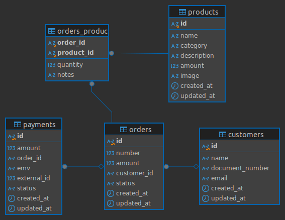

# Self-Service Database

> Este repositório tem como objetivo criar uma infraestrutura básica na AWS utilizando o Terraform como ferramenta de Infrastructure as Code (IaC). Ele inclui uma VPC, sub-redes, Internet Gateway e um banco de dados RDS PostgreSQL público.

## Instalação e Configuração

Antes de utilizar os recursos deste repositório, assegure-se de ter o Terraform instalado em sua máquina. Você pode encontrar as instruções de instalação na [Documentação oficial do Terraform.](https://learn.hashicorp.com/tutorials/terraform/install-cli).

Após a instalação, configure suas credenciais da AWS utilizando as seguintes variáveis de ambiente:

- `AWS_ACCESS_KEY_ID`.
- `AWS_SECRET_ACCESS_KEY`.

## Componentes

- VPC: Rede virtual isolada na AWS, utilizada para hospedar recursos de computação.
- Subnet: Segmentos da VPC distribuídos em uma ou mais zonas de disponibilidade da AWS.
- Internet Gateway: Ponto de conexão entre a VPC e a internet.
- RDS: Banco de dados relacional gerenciado pela AWS.

## Variáveis de Ambiente

Além das variáveis de ambiente padrão do Terraform, você deve configurar a seguinte variável para personalizar o comportamento da infraestrutura:

- TF_VAR_database_password: Senha do banco de dados do RDS.

## Instrução de Uso

1. Clone este repositório.
2. Configure suas credenciais da AWS.
3. Defina as variáveis de ambiente necessárias, como `TF_VAR_database_passord`.
4. Inicialize o Terraform executando:

```bash
terraform init
```

5. Visualize as alterações planejadas com:

```bash
terraform plan
```

6. Aplique as configurações e crie os recursos na AWS com:

```bash
terraform apply -var="TF_VAR_database_password=SUA_SENHA"
```

## Considerações

>Lembre-se de seguir as melhores práticas de segurança ao utilizar o Terraform para provisionar recursos na AWS. Isso inclui o gerenciamento seguro das credenciais e um controle de acesso apropriado aos recursos.

## Modelagem de Banco de Dados


